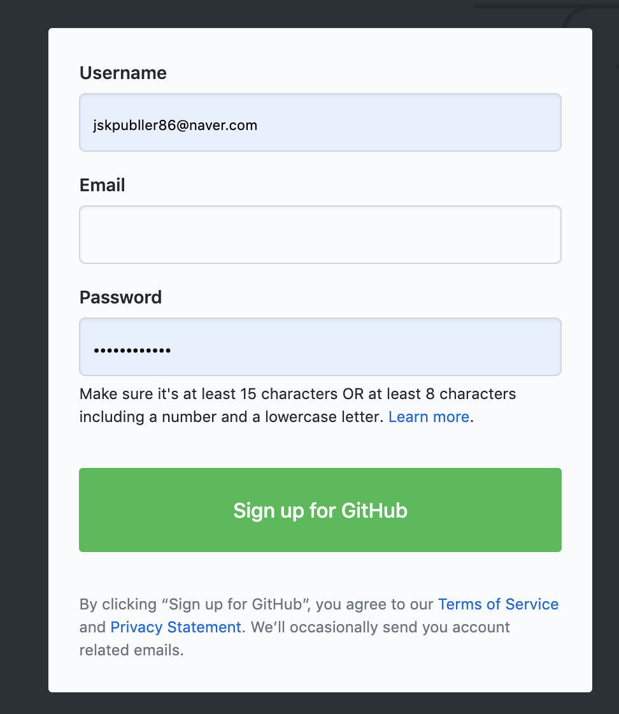

# 1. GitHub란

github는 git을 호스팅해주는 웹 서비스이며,  git 저장소 서버를 대신 유지 및 관리해주는 서비스이다.

쉽게 말해서 원격지에 저장소를 사용할 수 있게 도와주는 서비스이다.

# 2. GitHub 계정 생성

github를 사용하기 위해서는 먼저 계정을 생성해야한다. 

# 3. repository 생성

로그인을 하면 상단에 메뉴바의 오른쪽 끝을 보면  + 모양의 아이콘이 있으며 클릭하면 다음과 같이 여러 메뉴가 나오는데 그중에서 new repository 를 클릭하면 원격저장소에 repository 를 생성할 수 있다.

## 3.1. Create a new repository

저장소를 생성할 때는 저장소의 이름과 설명, 그리고 공개 여부를 선택하고 추가적으로 READEME 파일을 생성을 선택할 수 있다.

## 3.2. 저장소 생성 후

저장소를 생성하면  다음과 같은 화면을 처음 만나게 된다. 

기본적으로 상단에는 code, issues, pull requests, projects, wiki, security, insights, settings  탭 메뉴가 생성된다.

### 3.2.1. code 메뉴

코드 메뉴에서는 저장소에 푸쉬된  파일 또는 디렉토리들을 보여준다.  README.md 파일은 클릭하지 않아도 기본적으로 화면에 내용이 노출된다.

처음 생성한 상태일 경우 code 메뉴에서는 3가지 가이드를 보여준다. 

- ### …or create a new repository on the command line

  로컬 저장소를 생성하고 원격저장소를 연결한 후  push를 하기 위한 명령어 가이드이다.

- ### …or push an existing repository from the command line

  이미 로컬저장소가 연결되어 있을 경우 원격저장소로 push를 하기 위한 명령어 가이드이다.

- ### …or import code from another repositor

  다른 원격저장소로부터 파일 또는 폴더를 가져오기 위한 가이드이다.

### 3.2.2. Issues 메뉴

저장소의 파일들에 관련된 이슈 또는 프로젝트를 진행함에 있어 생기는 이슈들에 대해서 등록할 수 있으며 댓글을 달 수 있다. 

- **Filters** : 필터를 통해서 찾고자 하는 이슈를 손쉽게 검색할 수 있다.

#### 3.2.2.1. 이슈 생성하기

이슈를 생성하기 위해서는 New issue라고 써져있는 초록색 버튼을 클릭한다. 

클릭을 하면 다음과 같은 이슈를 작성할 수 있는 화면으로 이동한다. 

Title 입력란에는 제목을 Write 패널에는 내용을 작성해 준다.

submit new issue 버튼을 클릭하여 이슈를 등록하면 이슈 목록에 다음과 같이 보여진다.

이슈목록에서는 빨간색 테두리 부분의 스마일 아이콘을 통해서 이슈에 대한 reaction을 할 수 있다.

또한 스마일 아이콘 옆에 있는 토글 버튼을 클릭하면 다음과 같은 메뉴를 제공받을 수 있다.

