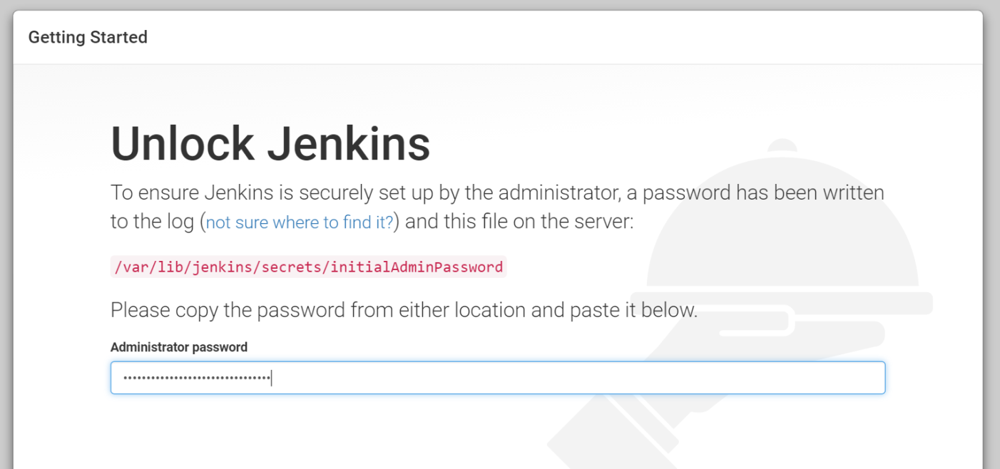

# 1. jekins docker 설치

~~~bash
$ docker pull jenkins/jenkins
~~~

# 1.1. 실행

[https://github.com/jenkinsci/docker/blob/master/README.md](https://github.com/jenkinsci/docker/blob/master/README.md)

~~~bash 
$ docker run -d -v jenkins_home:/var/jenkins_home -p 8080:8080 -p 50000:50000 jenkins/jenkins:lts
~~~

계정 생성 후 재실행

~~~
http://localhost:8080/restart
~~~

# 2. jenkins 설치 

## 2.1. 우분투(리눅스)
### 2.1.1. 자바 설치
jenkins 설치 파일이 jar 파일이므로 자바 실행환경을 설치해야한다.
~~~bash
$ sudo apt-get install default-jdk
$ sudo apt-get install default-jre (jre만을 원한다면)
~~~

### 2.1.2. jenkins 설치
젠킨스의 소스의 위치를 sources.list에 등록을 한 후 update로 소스 위치를 업데이트 해준다.
그 후에 jenkins를 설치한다.

~~~bash
wget -q -O - https://pkg.jenkins.io/debian/jenkins.io.key | sudo apt-key add -
sudo sh -c 'echo deb https://pkg.jenkins.io/debian-stable binary/ > /etc/apt/sources.list.d/jenkins.list'
sudo apt-get update
sudo apt-get install jenkins
~~~

설치 후에 service 명령어로 jenkins를 시작한다.

~~~bash
sudo service jenkins start
sudo chkconfig jenkins on
~~~

젠킨스의 기본포트는 8080이다. localhost:8080 접속하면 젠키스 초기 화면을 볼 수 있다. 

