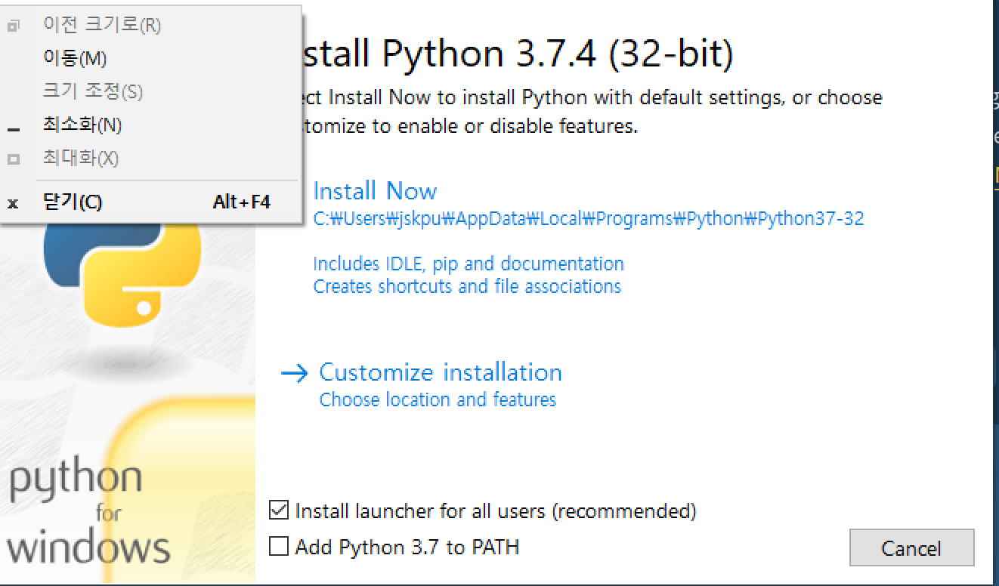

# 1. 다운로드

다음의 주소에서 다운로드 받는다. 

https://www.python.org/

# 2. 설치 진행

다운받은 파일을 클릭하여 설치를 진행한다. 

## 2.1. Mac OS

mac의 경우에는 파일로 설치할 경우 pip가 같이 설치 안된다. 

그러므로 터미널에  다음의 명령어를 입력한다. 

~~~bash
$ sudo easy_install pip
~~~

homebrew로  설치할 수도 있다.
~~~bash
$brew install python3
# PIP 설치
$ sudo easy_install pip

# 설치 확인 
$ pip

# pip 최신 버전으로 업그레이드
$pip install --upgrade pip
~~~

## 2.2. window

윈도우에서 인스톨 실행을 하면 다음의 화면이 나온다. 

여기서 아래의 "install launcher for all users" 와 "Add Python 3.7 to PATH" 옵션을 제공하는데  "Add Python 3.7 to PATH" 옵션은 윈도우의 환경설정의 PATH 변수에 Python을 설정해준다. 

두 옵션을 모두 체크하고 "install Now"를 클릭하여 설치를 진행한다. 

# 3. 설치 종료

설치가 끝나면 python과 pip가 설치된 것을 확인할 수 있다. 

~~~shell
$ python -V
# 파이쓴 버전 정보
Python 2.7.10

$ pip -V
# 파이프 버전 정보
pip 19.2.3 from /Library/Python/2.7/site-packages/pip-19.2.3-py2.7.egg/pip (python 2.7)

~~~

