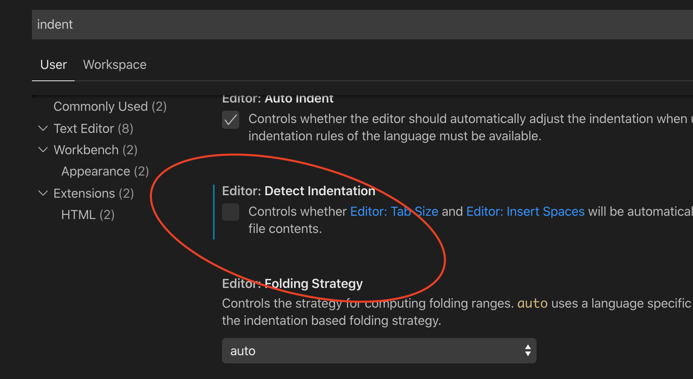

# visual studio code 환경설정
## 탭 설정
개발에 있어 탭의 간격은 보통 4칸으로 하고 공백으로 채운다. 
윈도우에서는 visual studio code에서는 File -> Preferences -> Settings 메뉴에서 설정할 수 있다. 
맥에서는 visual studio code에서는 code -> Preferences -> Settings 메뉴에서 설정할 수 있다.
Settings 패널에서 검색에 indent로 검색하면 쉽게 찾을 수 있다.

 
위 탭과 탭 공백의 설정에 내용을 보면 "설정한 값은 Editor: Detect Indentation이 활성화가 되어 있으면 파일의 내용에 따라 무시된다" 라는 내용이 있다. 

즉, Detect Indentation 옵션이 활성화가 되어 있으면 파일에 따라 적용이 안될 수도 있다는 것이다. 
그러므로 Detect Indentation 옵션을 비활성화 하여 설정한 탭과 탭 공백이 적용되게 해야 한다. 
