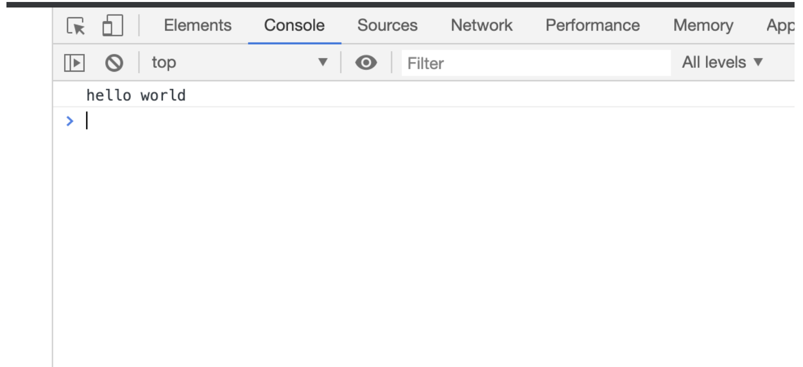
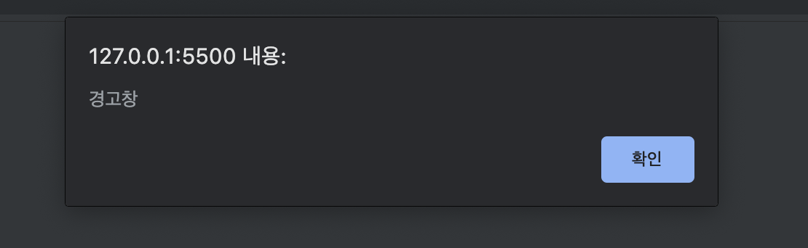
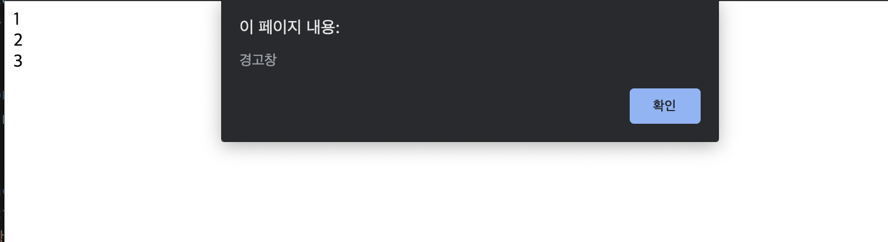
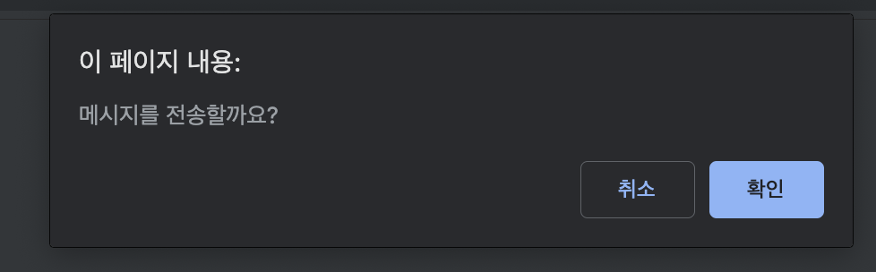

# document.write()

html  출력을 한다. 

~~~javascript
 document.write('
 html 
'); // 
 html 
 
 document.write("
 html 
"); // 
 html 
 
 document.write("
 'html' 
"); // 
 'html' 
 
 document.write('
 "html" 
'); // 
 "html" 
 
 document.write('
','html','
'); // 
 html 

 var str = html;
 document.write('
', str, '
'); // 
 html 

 document.write('
', 1+2+3+4, '
'); // 
 10 

~~~

브라우저가 로드되기전에 출력하면 기존   html을 삭제하지 않고 추가한다.

~~~html
<!DOCTYPE html>
<html lang="en">
<head>
    <meta charset="UTF-8">
    <meta name="viewport" content="width=device-width, initial-scale=1.0">
    <title>Document</title>
</head>
<body>
    
    

        두 번째 내용
    

</body>
</html>
​~~~browser~~~~~~~~~~
두 번째 내용
첫 번째 내용

~~~

브라우저가 로드 된 후 출력하면 기존 html을 지우고 출력한다.

~~~html
<!DOCTYPE html>
<html lang="en">
<head>
    <meta charset="UTF-8">
    <meta name="viewport" content="width=device-width, initial-scale=1.0">
    <title>Document</title>
    
</head>
<body>
    1  
    2  
    3  
</body>
</html>
​~~~browser~~~~~~~
4
5
~~~

# console.log()

console.log 로그를 이용하면 상세한 정보를 보여준다. alert로 보여주는 정보보다 훨씬 자세하다.

~~~ javascript
console.log('hello world');
~~~

브라우저의  콘솔창에 직접 입력할 수도 있다.

# alert()

경고창을 출력한다. 

~~~javascript
alert('경고창');
~~~

alert()가 실행 중일 때는 다른 프로그램들은 실행을 중지한다.

~~~html
<!DOCTYPE html>
<html lang="en">
<head>
    <meta charset="UTF-8">
    <meta name="viewport" content="width=device-width, initial-scale=1.0">
    <title>Document</title>
    
</head>
<body>

</body>
</html>
~~~

실행 중지

# confirm()

사용자에게 확인 또는 취소를 입력받는다. 확인은 true, 취소는 false를 반환하다. 마찬가지로 사용자에게 입력받을 때까지 다른 프로그램을 멈춘다.

~~~javascript
var answer = confirm('메시지를 전송할까요?');  // 확인을 누르면 true, 취소면 false
~~~

# prompt()

사용자에게 입력값을 받는다.

~~~javascript
var answer = prompt('좋아하는 동물을 입력해주세요.','코끼리'); // 확인을 누르면 입력한 값을, 취소를 누르면 null 값을 대입한다.
console.log(answer); // 취소시 null
~~~

입력한 값은 모두 문자열로 반환한다.

~~~javascript
var num = prompt('숫자를 입력하세요.'); 
console.log(typeof num); // string
var bool = prompt('true false를 입력하세요.'); 
console.log(typeof bool); // string
~~~

마찬가지로 취소를 누르면 null 값이 입력된다.

~~~javascript
var num = prompt('숫자를 입력하세요.'); // 취소를 선택하면 null 값 반환
console.log(num); // null
~~~

