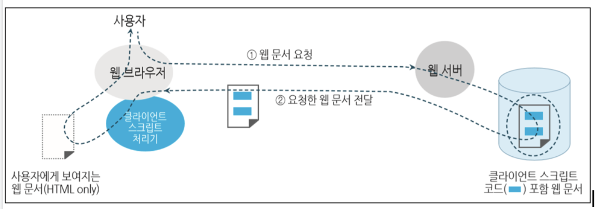

# 자바스크립트란

자바스크립트 언어는 웹문서를 동적으로 출력한다.

자바스크립트는 클라이언트에서 실행되는 클라이언트스크립트를 작성하는 표준 언어이다. 

자바스크립트는 넷스케이프사의 브렌트 아이크가 라이브스크립트라는 이름으로 개발한 것으로 1995년 Java 언어의 개발 권한을 가진 썬 마이크로 시스템즈가 그 개발권한을 인수하면서 "자바스크립트"라는 현재의 이름으로 변경하여 발전시킨 언어이다. 

자바스크립트의 표준은 ECMA (European Computer Manufacture's Association, 유럽컴퓨터 제조협회)에서 관리하며, 공식명칭도 ECMA 스크립트언어이다.

자바스크립트는 다음과 같은 특징을 같는다. 

- 모든 웹 브라우저에서 곧바로 실행되는 플랫폼 독립적인 인터프리터 언어이다.
- HTML 문서에 필요한 부분 코드만을 포함시켜 실행하는 스크립트 언어이다. 따라서 별도의 정형화된 프로그램 구조는 존재하지 않는다.
- 동적 타이핑(dynamic typing)을 지원해서 변수들의 자료형을 자유롭게 변환할 수 있다. 
- 객체 기반 (object based)의 언어로, C/C++, java 등과 유사한 문법적 특성을 가진다.  그리고 특별히 DOM, BOM과 같은 웹 브라우저 및 HTML 문서와의 인터페이를 위한 다양한 객체들을 제공한다.
- 웹 브라우저 환경에서 발생하는 이벤트 처리를 지원한다. 즉, 웹 브라우저에서 HTML 문서와 사용자들과의 다양한 상호작용에 필요한 처리를 지원한다. 

자바스크립트는 웹문서가 로드될 때 실행된다. 

### 자바스크립트 실행 흐름



## 자바스크립트를 나타내는 3가지 방법

자바스크립트는 3가지 방법으로 나타낼 수 있다. 

- 내부 자바스크립트 

  html의 head나 body영역 사용 

  ~~~html
  <script> 자바스크립트 코드 </script>
  ~~~

  **example**
  
  ~~~html
  <html>
    <head>
      <script>
      	var subject1="Welcome to Javascript! <br>";
        var subject2="Enjoy Javascript programming!";
        function welcome(target){
          document.write(target);
        }
      </script>
    </head>
    <body>
      ....
      <h3>
         내부 자바스크립트 작성(2)
      </h3>
      <script>
      	welcome(subject1);
        welcome(subject2);
      </script>
    </body>
  </html>
  ~~~
  
- 외부 자바스크립트

  src 속성에 경로 지정

  ~~~html
  <script src="자바스크립트 파일경로 또는 URL"></script>
  ~~~

  **example**

  ~~~html
  <!DOCTYPE html>
  <html>
    <head>
      <title>외부 자바스크립트</title>
    </head>
    <body>
      <h3>
        외부 자바스크립트 작성
      </h3>
      <script src="welcome.js"></script>
    </body>
  </html>
  ~~~

  ~~~~javascript
  // welcome.js
  
  var subject1="Welcome to Javascript! <br>";
  var subject2="Enjoy Javascript programming!";
  
  function welcome(target){
    document.write(target);
  }
  
  welcome(subject1);
  welcome(subject2);
  ~~~~

  외부 스크립트의 장점은 html과 분리된 되고 캐시되기 때문에 웹 페이지의 로딩을 빠르게 한다.

- 인라인 자바스크립트

  DOM 요소에 on 이벤트나 또는 a 요소에 href 속성에 스크립트를 정의 하는 방법

  ~~~html
	<HTML-태그 이벤트속성="자바스크립트 코드">....</HTML-태그>
  또는 
  <a href="javascript:자바스크립트 코드">....</a>
  ~~~
  
    **example**
  
    ~~~html
  <!DOCTYPE html>
    <html lang="ko" dir="ltr">
    <head>
    <meta charset="utf-8">
    <title>인라인 자바스크립3</title>
    </head>
    <body>
      <h3>Hello Javascript</h3>
      <button type="button" onclick="alert('Welcome to Web Programming')"></button>
      <a href="javascript:alert('Welcome to Javascript!');">자바스크립트</a>
    </body>
    </html>
    ~~~


## 자바스크립트 기본문법

#### 자바스크립트 구조

자바스크립트는 정형화된 프로그램 구조를 정의하지 않고 HTML 문서에서 필요한 곳에 코드를 포함 시키는 방법으로 사용한다. 

정의를 하고 사용하는 방식으로 사용한다. 

~~~html
<!DOCTYPE html>
<html lang="ko" dir="ltr">
<head>
<meta charset="utf-8">
<script>
//정의
var obj1 = "CSS3"
function Welcome(obj) {
    document.write(obj);
}
</script>
</head>
<body>
  <h3>Welcome! &nbsp; HTML5 웹프로그래밍</h3>
  <ol>
    <li>Using HTML! + <script>welcome(obj1); //사용 </script></li>
    <li>
       <script>
            Welcome('Using Javascript!'); //사용
       </script>
    </li>
  </ol>
</body>
</html>
~~~

#### 자바스크립트의 문자 집합

자바스크립트는 기본 "utf-8" 인코딩 방식을 사용한다.  (Utf-8은 영문자는 1바이트로, 한글은 3바이트로 나타냄, 그리고 다국어 문자를 모두 표현할 수 있음)

자바스크립트는  영문 대소문자를 구분한다. 

#### 주석문 

자바스크립트에는 한줄 주석과 여러줄 주석이 있다.  주석은 실행에 영향을 끼치지 않는다. 

~~~~javascript
//한 라인의 주석문(// 이후의 문자열은 모두 주석으로 처리됨)
/* 여러 라인에 걸쳐 있는 주석문 */
~~~~


## 변수 정의 및 선언

변수명과 자료형의 선언없이 필요한 부분에서 바로 사용할 수 있고 미리 정의해서 사용할 수도 있다. 

또한 변수의 자료형은 항상 고정되지 않고 저장되는 값에 따라 자동으로 결정된다. 

변수명은 반드시 다음을 지켜야 한다.

- 변수명은 반드시 숫자가 아닌 문자 또는 $, _로 시작해야 한다. 
- 영문 대소문자를 구분한다. 
- 변수명에는 공백문자를 포함하지 않는다.
- 자바스크립트 예약어와 같으면 안된다.

선언의 방식은 다음과 같이 할 수 있다.

```javascript
var name;  // 변수값을 지정하지 않는 변수 정의
var name1 = value1;		// 변수명과 변수값의 지정
var name2 = value2, name3, name4 = value4,...;   // 여러 변수들의 정의
var num = num2 = 10; //num = 10, num2 = 10
num2 = 0; // num = 10, num2 = 0
var KOR = 10;
var _state = true;
var subject="javascript", total;
var $obj = document.getElementById('obj');
var chkNum = 0;
var chk_num = 0;
globalVar = 1; // var를 안쓰면 전역변수

```

var를 쓰면 지역변수 안쓰면 전역변수가 된다.

~~~javascript
function check(){
  var localVar = 10;
  globalVar = 20;
}
console.log(localVar); // undefined 에러
console.log(globalVar); // 20
~~~

# 함수

함수를 정의 할때는 function 키워드를 사용한다.

함수는 아래와 같이 정의하고 사용할 수 있다. 

~~~javascript
// 정의
function functionName(params) { // functionName 이라는 함수 이름으로 정의 
  console.log(params);
}
var functionName2 = function (params) { // functionName2 변수에 익명함수를 할당
  console.log(params)
}
function functionName3() {
  console.log(3);
}
// 호출
functionName(1); // 1 
functionName2(2); // 2 
functionName3(); // 3
~~~

함수의 이름이 없는 함수를 익명 함수라 한다.

```javascript
function () { 
  console.log('익명 함수')
}
```

호출할 때 받을 파라미터 변수를 지정할 수 있다. 

~~~javascript
function sum(num1){  // 파라미터 1개
   console.log(num1);
}
function sum2(num1, num2) {  // 파라미터 2개
   console.log(num1 + num2);
}

// 호출
sum(1); // 1
sum2(1,2); // 3

~~~

함수는 자바 오버로딩을 못하지만 함수 오버라이딩은 할 수있다. 

~~~javascript
function sum(num1) {
  console.log('params1 : ' + num1);
}
function sum(num1, num2) {
  console.log('params2 : ' + (num1 + num2));
}
function sum(num1, num2, num3) {
  console.log('params3 : ' + (num1 + num2 + num3));
}
// 호출
console.log(sum(1)); // params3 : NaN
console.log(sum(1,2)); // params3 : NaN 
console.log(sum(1,2,3)); // params3 : 6 
~~~

파라미터의 값은 반드시 정의되어야한다.

~~~javascript
function sum(num1, num2, num3) { 
   console.log(num1 + num3);
}

sum(1,undefined,2); // 3
sum(1,null,3); // 4
sum(1,,2); // 2번째 매개변수 값이 정의되어 있지 없어서 에러.

~~~

function에는 파라미터들의 정보를 가지는 arguments라를 객체가 있다. arguments는 인덱스 0번부터 파라미터를 저장한다.

 ~~~ javascript
function getNum() { 
  console.log(typeof arguments); // object
  console.log(arguments);
}
    
getNum(); // {}
getNum(1,'문자'); // {0: 1, 1: '문자'}
getNum(1,'문자',null); // {0: 1, 1: '문자', 2: null}
getNum(1,'문자',null,undefined); // {0: 1, 1: '문자', 2: null, 3: undefined}
getNum(1,'문자',null,undefined,true); // {0: 1, 1: '문자', 2: null, 3: undefined, 4: true}

 ~~~

() 소괄호를 이용하면 선언과 동시에 실행시킬 수 있다. Self-Invoking이라고 한다.

~~~javascript
(function () {
  var x = "Hello!!";  // I will invoke myself
  console.log(x);
})(); // Hello!!
~~~

소괄호 없이 함수 이름만 부르면 실행하지 않고 내용만 있는 상태가 된다.

~~~javascript
function sum() { 
  console.log(1 + 2 + 3);
}
var sum2 = sum;  // 실행하지 않고 함수 내용만 있음.
var sum3 = sum(); // 실행하고 리턴 값이 없기 때문에 undefined가 됨.
console.log(sum2); // function sum(){ console.log(1 + 2 + 3); }
console.log(sum3); // undefined 
~~~


 


